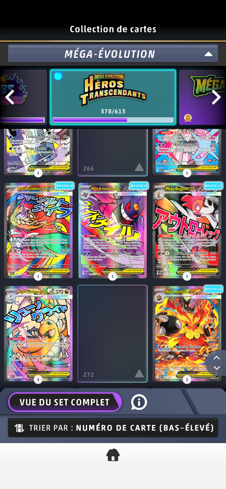

**Bug ID:**  BUG-PTCGL-IOS-001

**Title:**  Incorrect inventory count during pack opening

**Environment:**
   - Device / Platform: iPhone 12 Pro
   - OS: iOS 26.2
   - Browser/App: Pokémon TCG Live
   - Version: 1.34.0
   - Reproducibility rate: 5/5

**Steps to Reproduce:**
- Prerequisites: A copy of Mega Dragonite ex [ASC 271] was owned before noticing bug reproduction + Logged in successfully to application.
  
1. Open pack containing Mega Dragonite ex SIR (#217).
2. During animation, check collection count for #217.
3. View pack review card count.
4. Open Card Dex → Mega Dragonite ex #217.

**Expected Behavior:**

Count increments correctly (1→2 etc.) across Pack Opening/Pack review/CardDex, no negative values.

**Actual Behavior:** 
- Pack opening animation: Incorrect (-1 owned).
- Pack review page: Incorrect (1 owned).
- CardDex: Correct (3 owned).

**Severity/Priority:**

  Severity: Minor (visual confusion; no gameplay impact) 
  
  Priority: Low

**Attachments:**

  Screenshots/Video:

<table>
  <tr>
    <td>
      
    </td>
    <td>
      
    </td>
    <td>
      
    </td>
  </tr>
</table>

