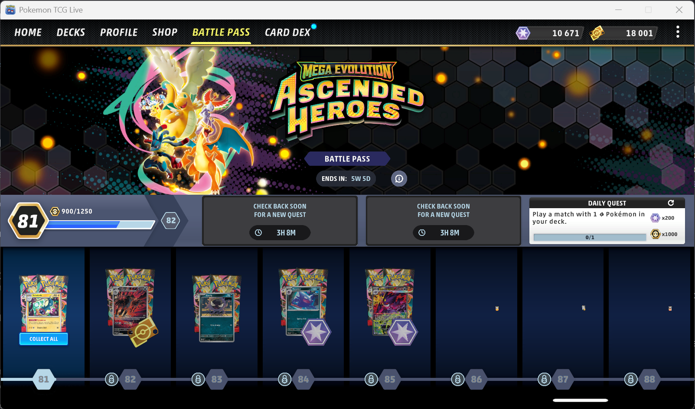
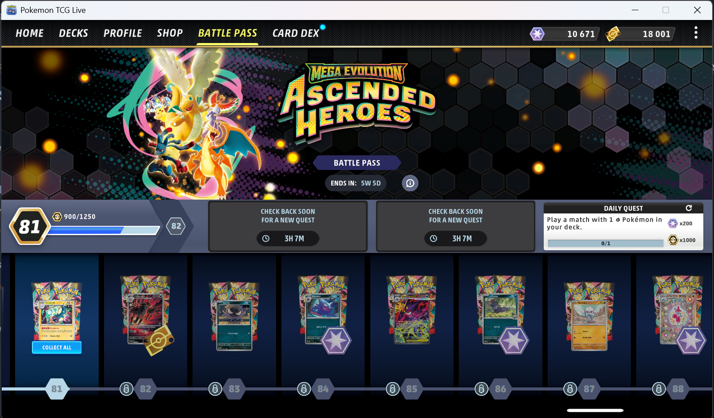

**Bug ID:**  BUG-PTCGL-WIN-001

**Title:**  Battle Pass thumbnails fail to populate on initial load 

**Environment:**
   - Device / Platform: HP Elitebook 840 G8
   - OS: Windows 11
   - Browser/App: Pokémon TCG Live
   - Version: 1.34.0
   - Reproducibility rate: 3/3

**Steps to Reproduce:**
- Prerequisites: User is logged into Pokémon TCG Live
  
1. Open Battle Pass screen
2. Scroll down until tiers 86, 87, and 88 are visible.
3. Scroll so that tiers 86, 87, and 88 are completely off-screen.
4. Scroll back until tiers 86, 87, and 88 are visible again.

**Expected Behavior:**

All Battle Pass tier thumbnails should load and remain visible while scrolling through the Battle Pass.

**Actual Behavior:** 
On first scroll to tiers 86, 87, and 88, the thumbnails do not load and appear as empty slots.
After scrolling past these tiers and then back again, the thumbnails load and display correctly.

**Severity/Priority:**

  Severity: Minor (visual issue; no gameplay impact) 
  
  Priority: Low

**Attachments:**

  Screenshots/Video:

<table>
  <tr>
    <td>
      
    </td>
    <td>
      
    </td>
  </tr>
</table>

