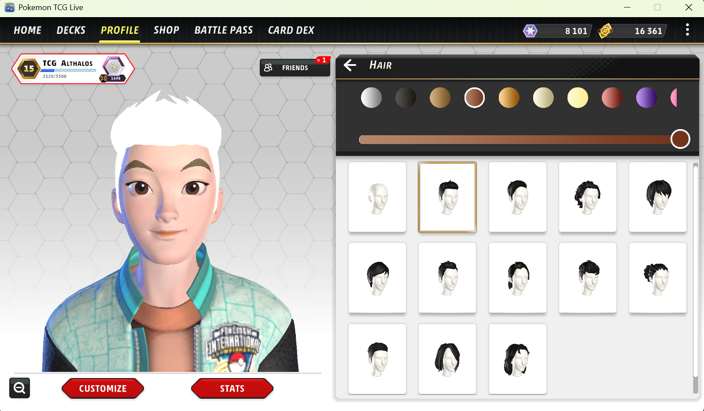
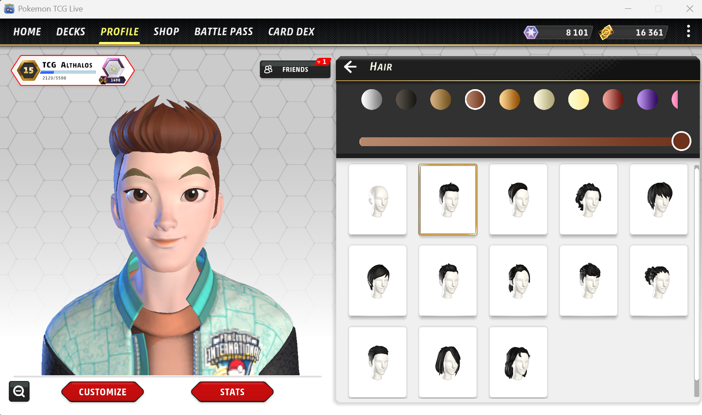
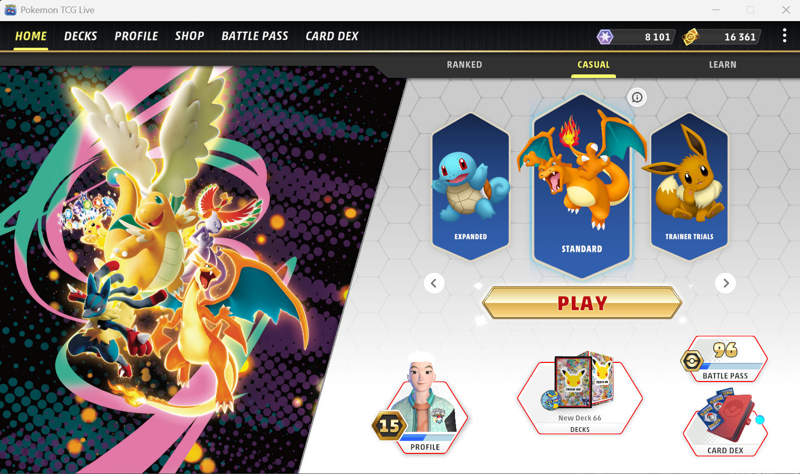
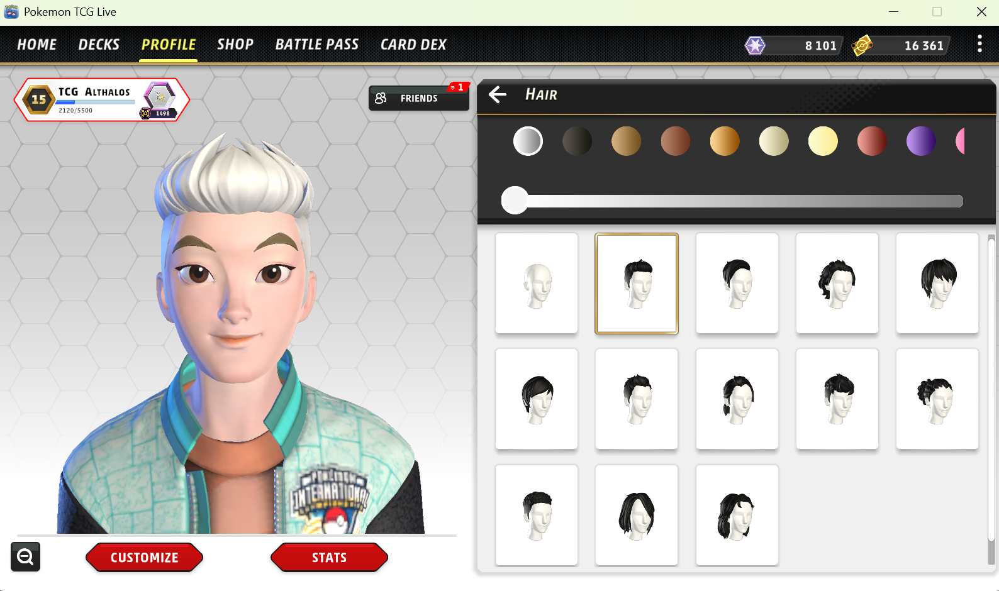

**Bug ID:**  BUG-PTCGL-WIN-002

**Title:**  [Avatar Editor] Changing avatar gender resets hair color and removes texturing

**Environment:**
   - Device / Platform: HP Elitebook 840 G8
   - OS: Windows 11
   - Browser/App: Pokémon TCG Live
   - Version: 1.35.0
   - Reproducibility rate: 3/3

**Steps to Reproduce:**
- Prerequisites: User is logged into Pokémon TCG Live
  
1. Open the Profile screen.
2. Change the avatar gender from male to female.

**Expected Behavior:**

Changing avatar gender should switch to the female avatar while preserving equivalent customization settings (including selected hair color and hair texturing) from the previous avatar.

**Actual Behavior:** 

After changing avatar gender, the avatar’s hair changes to white and loses all texturing, resulting in a flat, untextured appearance.

**Severity/Priority:**

  Severity: Minor (visual issue; no gameplay impact) 
  
  Priority: Low

**Attachments:**

  Screenshots/Video:

<table>
  <tr>
    <td>
      
    </td>
    <td>
      
    </td>
    <td>
      
    </td>
    <td>
      
    </td>
  </tr>
</table>

https://github.com/user-attachments/assets/cfa06ed7-aa88-4a0c-b917-6486f41e35dd

