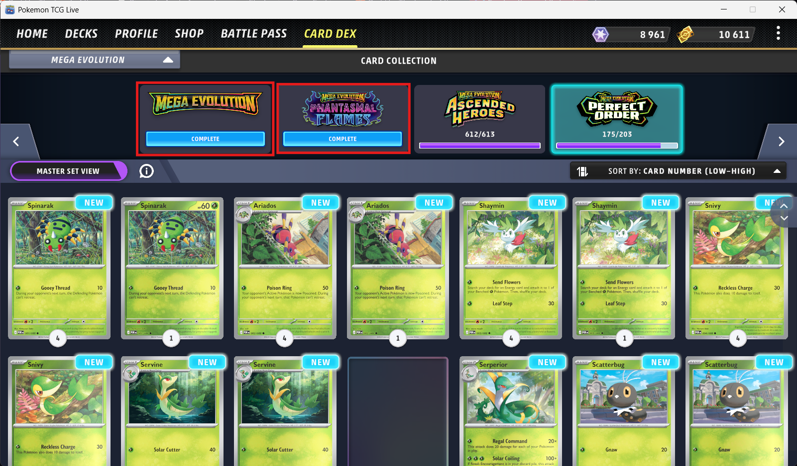
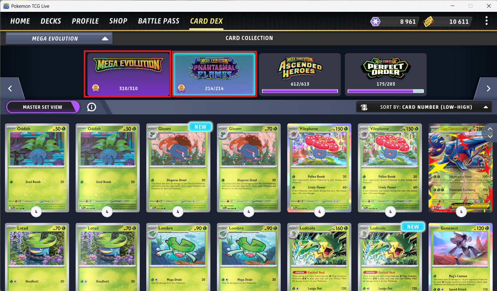
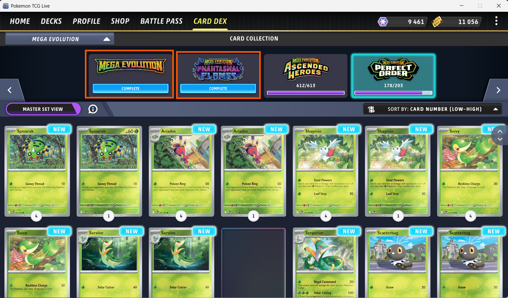

## Bug ID: `BUG-PTCGL-WIN-003`

**Title:** Card Dex: Master Set Completion Medal Resets After Client Restart

**Reporter:** [Quest2Test]

**Date:** [05-04-2026]

**Status:** `Open`

**Assigned To:** Pokemon TCG Live team


---

## Environment

| Field | Details |
|---|---|
| Device / Platform | PC |
| Operating System | Windows 11 |
| Browser / Application | Pokemon TCG Live |
| Build / Version | V 1.36.0.894846.20260312_2210 |
| Component / Area | UI |
| Reproducibility Rate | 3/3 - always reproducible |

---

## Description

### Steps to Reproduce
**Prerequisites:** An account that has all the cards for any one set. (Master Set)

1. Home > Card Dex
2. Find set with complete set
3. Click Complete button under set icon
4. Observe "Master Set Completed" Animation and Medal appear
5. Close and Restart Pokemon TCG Live Client
6. Home > Card Dex
7. Find Set and observe master set completion status

### Expected Behaviour
Once all cards for a set are collected and the Complete button is clicked, the "Master Set Completed" animation and medal should play. The awarded medal should persist across client restarts and sessions without requiring re-interaction.

### Actual Behaviour
After restarting the client, the "Master Set Completed" completion prompt reappears as if unclaimed. Re-interacting with it re-triggers the animation and medal, suggesting the claimed state is not being saved server/client-side between sessions.

---

## Severity & Priority

| Field | Value |
|---|---|
| Severity | `Minor` |
| Priority | `Low` |

**Severity guide:**
- **Critical** - Game crash, data loss, progression blocker, security issue
- **Major** - Core feature broken, significant impact on gameplay or UX
- **Minor** - Feature partially broken, workaround exists
- **Trivial** - Cosmetic issue, typo, minor visual glitch

---

## Regression

| Field | Details |
|---|---|
| Regression? | No |
| Last known working build |  |
| Notes |  |

---

## Workaround

- **Workaround available?** No
- **Description:** 

---

## Evidence

- **Screenshots / Video:**

<table>
  <tr>
    <td>
      
    </td>
    <td>
      
    </td>
    <td>
      
    </td>
  </tr>
</table>


https://github.com/user-attachments/assets/7c312f60-fe10-42b9-877d-46970023b83d


- **Logs / Console Output:**

```

```

---

## Additional Notes

---
