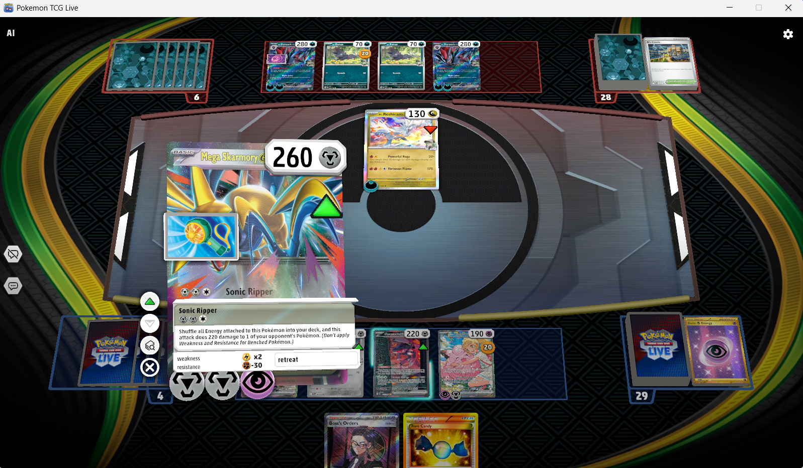
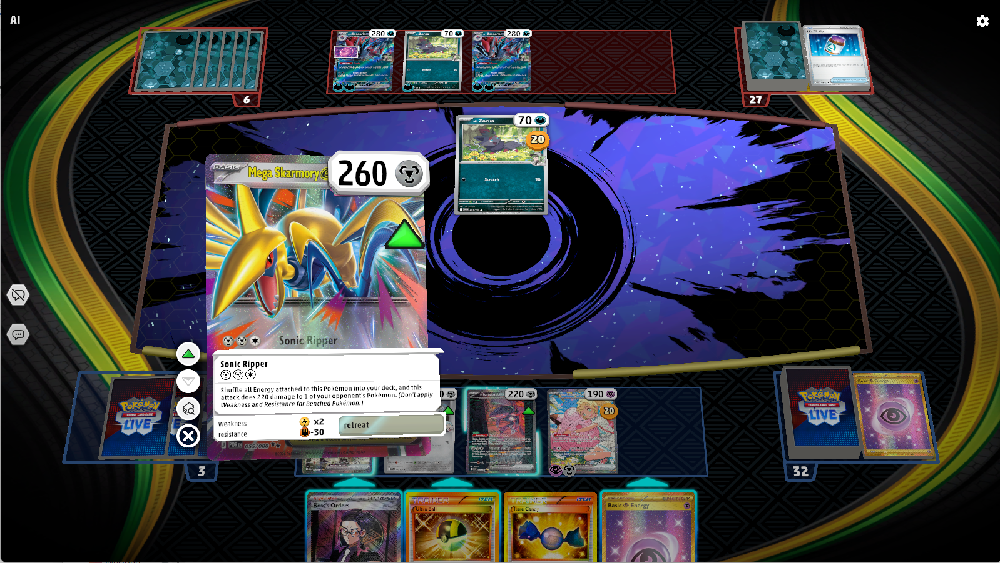
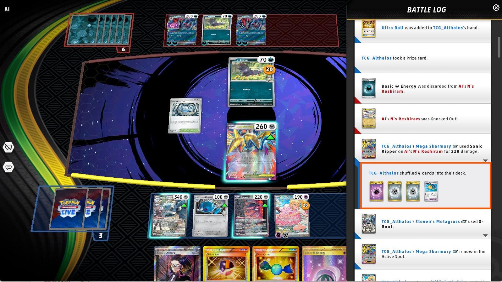
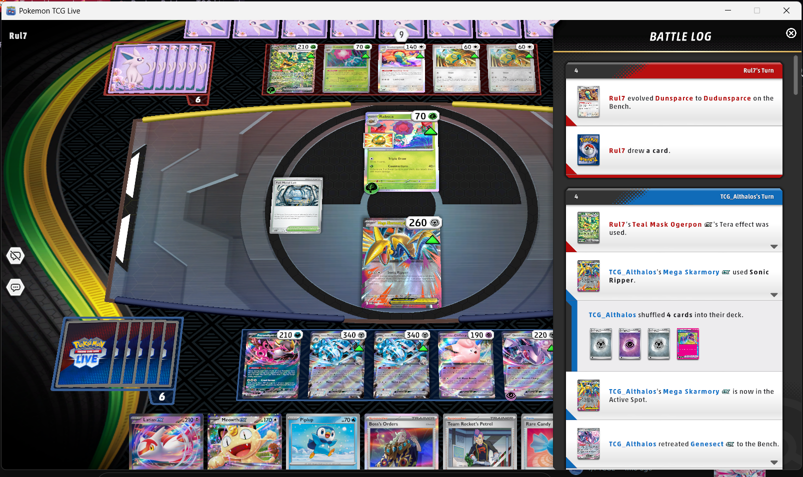

## Bug ID: `BUG-PTCGL-WIN-004`

**Title:** Gameplay: Mega Skarmory ex 'Sonic Ripper' Attack Shuffles All Attached Cards Instead of Attached Energy Only

**Reporter:** [Quest2Test]

**Date:** [05-04-2026]

**Status:** `Open`

**Assigned To:** Pokemon TCG Live team


---

## Environment

| Field | Details |
|---|---|
| Device / Platform | PC |
| Operating System | Windows 11 |
| Browser / Application | Pokemon TCG Live |
| Build / Version | V 1.36.0.894846.20260312_2210 |
| Component / Area | Gameplay |
| Reproducibility Rate | 3/3 - always reproducible |

---

## Description

### Steps to Reproduce
**Prerequisites:** Use a Decklist that contains Mega Skarmory ex and any attachable tool (Hero's Cape / Handheld Fan)

1. Home > Casual > Play or Home > Deck List > Test Deck
2. Setup Mega Skarmory ex with appropriate energies (2 Steel + 1 Other) and Hero's Cape ACE SPEC or other attachable tool card
3. Use Mega Skarmory ex 'Sonic Ripper' Attack
4. Observe all cards attached being shuffled into deck after the attack
5. Check Battle Logs to confirm all attached cards were shuffled into the deck

### Expected Behaviour
When using Mega Skarmorys ex's 'Sonic Ripper' attack, only energy cards attached to Mega Skarmory ex should be shuffled back into the deck.

### Actual Behaviour
When using Mega Skarmorys ex's 'Sonic Ripper' attack, all cards attached to the Mega Skarmory ex are shuffled back into the deck.

---

## Severity & Priority

| Field | Value |
|---|---|
| Severity | `Minor` |
| Priority | `Medium` |

**Severity guide:**
- **Critical** - Game crash, data loss, progression blocker, security issue
- **Major** - Core feature broken, significant impact on gameplay or UX
- **Minor** - Feature partially broken, workaround exists
- **Trivial** - Cosmetic issue, typo, minor visual glitch

---

## Regression

| Field | Details |
|---|---|
| Regression? | No |
| Last known working build |  |
| Notes |  |

---

## Workaround

- **Workaround available?** Yes
- **Description:** Do not use Mega Skarmory ex / 'Sonic Ripper' attack or avoid using tool cards on Mega Skarmory ex unless necessary
---

## Evidence

- **Screenshots / Video:**

<table>
  <tr>
    <td>
      
    </td>
    <td>
      
    </td>
    <td>
      
    </td>
    <td>
      
    </td>
  </tr>
</table>


https://github.com/user-attachments/assets/a21f22f1-e747-4d05-9dea-098d54d2b1fc


- **Logs / Console Output:**

```

```

---

## Additional Notes

---
