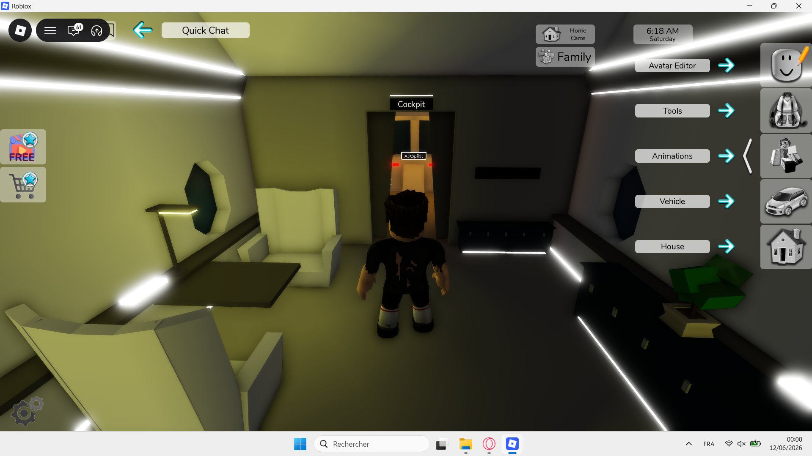
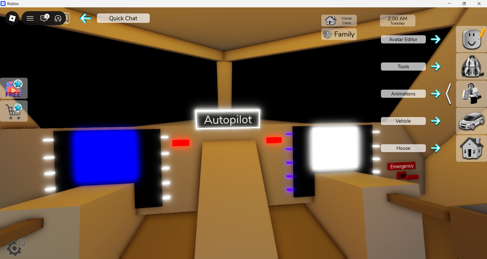
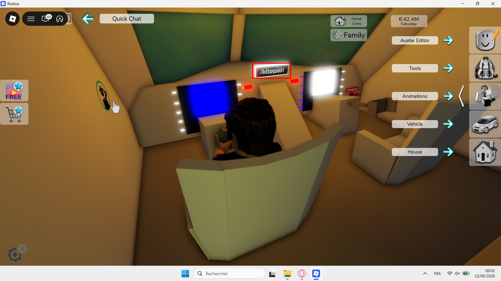

## Bug ID: `BUG_BHR_WIN_002`

**Title:** Graphical Issue: Autopilot Sign becomes illegible when viewed up close

**Reporter:** Quest2Test

**Date:** 12-06-2026

**Status:** `Open`

**Assigned To:** Brookhaven Team

---

## Environment

| Field | Details |
|---|---|
| Device / Platform | Windows 11 |
| Operating System | Version	10.0.26200 Build 26200 |
| Browser / Application | Roblox: Brookhaven_RP |
| Build / Version | V1.8022 |
| Component / Area | Graphical |
| Reproducibility Rate | 3/3 - always reproducible |

---

## Description

### Steps to Reproduce
**Prerequisites:** Valid Roblox account

1. Load into Brookhaven RP game.
2. Enter Airplane, via the airport.
3. Head towards the cockpit and monitor the Autopilot sign before entering.
4. Enter the cockpit, sit down in the pilot's chair, and monitor the Autopilot sign.

### Expected Behaviour
Regardless of location within the plane, if the Autopilot sign is visible to the character, the text on the sign should remain readable and clear.

### Actual Behaviour
When the character sits in the chair, the autopilot sign becomes unreadable due to multiple characters overlapping.

---

## Severity & Priority

| Field | Value |
|---|---|
| Severity | `Trivial` |
| Priority | `Minor` |

**Severity guide:**
- **Critical** - Game crash, data loss, progression blocker, security issue
- **Major** - Core feature broken, significant impact on gameplay or UX
- **Minor** - Feature partially broken, workaround exists
- **Trivial** - Cosmetic issue, typo, minor visual glitch

---

## Regression

| Field | Details |
|---|---|
| Regression? | No |
| Last known working build |  |
| Notes |  |

---

## Workaround

- **Workaround available?** No
- **Description:**

---

## Evidence

- **Screenshots / Video:**

<table>
  <tr>
    <td>
      
    </td>
    <td>
      
    </td>
    <td>
      
    </td>
  </tr>
</table>

- **Logs / Console Output:**

---

## Additional Notes

---
