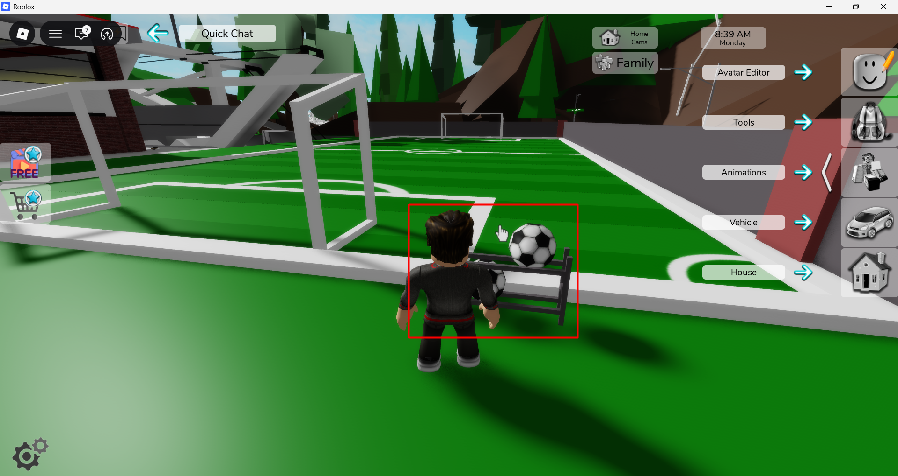

https://github.com/user-attachments/assets/da9660fb-7846-47f5-bbb7-56d1c4abd114

## Bug ID: `BUG_BHR_WIN_003`

**Title:** Gameplay Issue: Interactive Football stand does not allow character to pick up ball to play

**Reporter:** Quest2Test

**Date:** 12-06-2026

**Status:** `Open`

**Assigned To:** Brookhaven Team

---

## Environment

| Field | Details |
|---|---|
| Device / Platform | Windows 11 |
| Operating System | Version	10.0.26200 Build 26200 |
| Browser / Application | Roblox: Brookhaven_RP |
| Build / Version | V1.8022 |
| Component / Area | Gameplay |
| Reproducibility Rate | 2/4 - Sometimes reproducible |

---

## Description

### Steps to Reproduce
**Prerequisites:** Valid Roblox account

1. Load into Brookhaven RP game.
2. Head to Football/Soccer pitch at Brookhaven High School.
3. Attempt to interact with football stand to retrieve a ball to play with.

### Expected Behaviour
Once the character interacts with the football stand, the character should receive a ball to play with.

### Actual Behaviour
When attempting to interact with the stand, nothing happens.

---

## Severity & Priority

| Field | Value |
|---|---|
| Severity | `Minor` |
| Priority | `Minor` |

**Severity guide:**
- **Critical** - Game crash, data loss, progression blocker, security issue
- **Major** - Core feature broken, significant impact on gameplay or UX
- **Minor** - Feature partially broken, workaround exists
- **Trivial** - Cosmetic issue, typo, minor visual glitch

---

## Regression

| Field | Details |
|---|---|
| Regression? | No |
| Last known working build |  |
| Notes |  |

---

## Workaround

- **Workaround available?** No
- **Description:**

---

## Evidence

- **Screenshots / Video:**

<table>
  <tr>
    <td>
      
    </td>
  </tr>
</table>

https://github.com/user-attachments/assets/ae0538d2-69ce-4196-9558-45f1e748e383

- **Logs / Console Output:**

---

## Additional Notes

---
