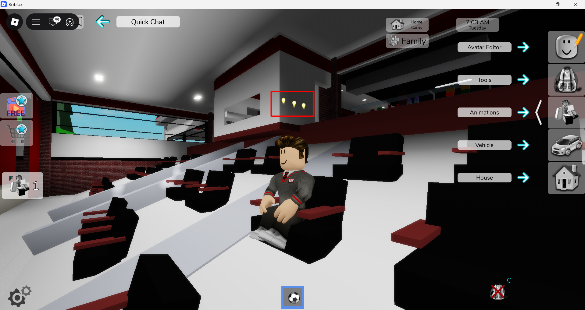
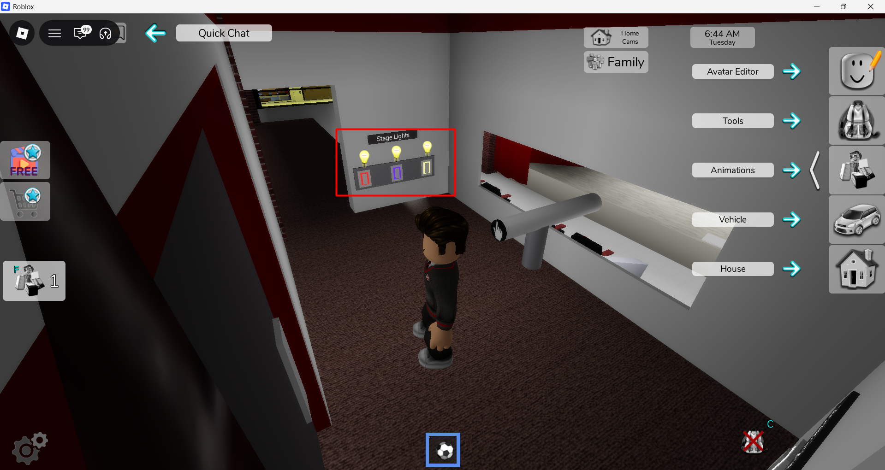
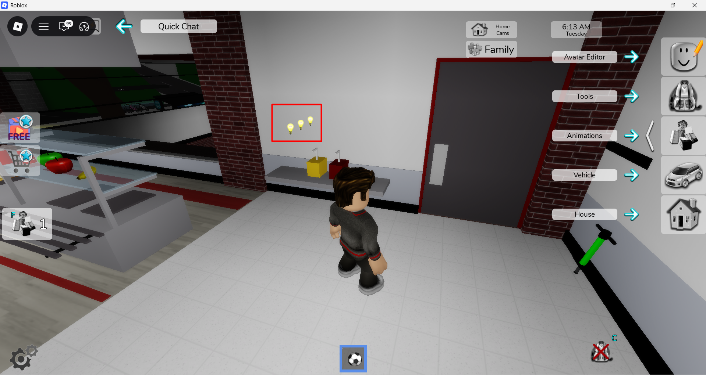

## Bug ID: `BUG_BHR_WIN_004`

**Title:** Graphical Issue: Lightbulb indicator images can be seen through walls 

**Reporter:** Quest2Test

**Date:** 12-06-2026

**Status:** `Open`

**Assigned To:** Brookhaven Team

---

## Environment

| Field | Details |
|---|---|
| Device / Platform | Windows 11 |
| Operating System | Version	10.0.26200 Build 26200 |
| Browser / Application | Roblox: Brookhaven_RP |
| Build / Version | V1.8022 |
| Component / Area | Graphical |
| Reproducibility Rate | 3/3 - Always reproducible |

---

## Description

### Steps to Reproduce
**Prerequisites:** Valid Roblox account

1. Load into Brookhaven RP game.
2. Head towards Brookhaven High cafeteria on first floor, head towards the projector booth for auditorium.
3. Before entering the booth, look around the walls and monitor for lightbulb images.
4. Head inside the auditorium and view the outside of the projector booth and monitor for lightbulb images.

### Expected Behaviour
The lightbulb images should only appear once in close proximity to the light switches within the projector booth.

### Actual Behaviour
Lightbulb images appear from quite a far distance inside the cafeteria and auditorium which are outside of the booth.

---

## Severity & Priority

| Field | Value |
|---|---|
| Severity | `Trivial` |
| Priority | `Minor` |

**Severity guide:**
- **Critical** - Game crash, data loss, progression blocker, security issue
- **Major** - Core feature broken, significant impact on gameplay or UX
- **Minor** - Feature partially broken, workaround exists
- **Trivial** - Cosmetic issue, typo, minor visual glitch

---

## Regression

| Field | Details |
|---|---|
| Regression? | No |
| Last known working build |  |
| Notes |  |

---

## Workaround

- **Workaround available?** No
- **Description:**

---

## Evidence

- **Screenshots / Video:**

<table>
  <tr>
    <td>
      
    </td>
    <td>
      
    </td>
    <td>
      
    </td>
  </tr>
</table>

https://github.com/user-attachments/assets/3495f5fd-6de5-48dc-8687-f58cdb48e935

- **Logs / Console Output:**

---

## Additional Notes

---
