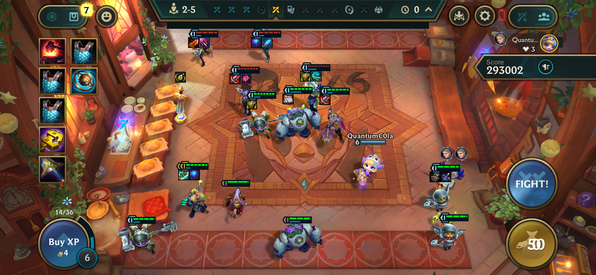
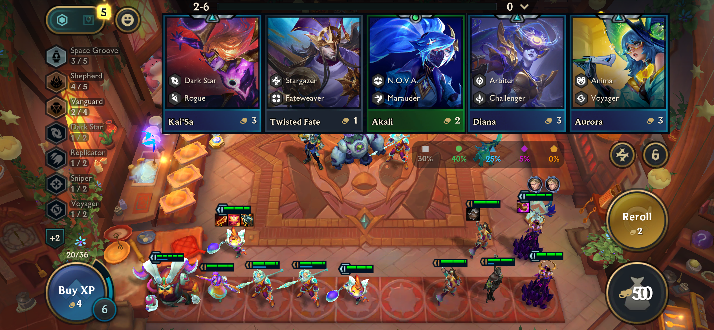
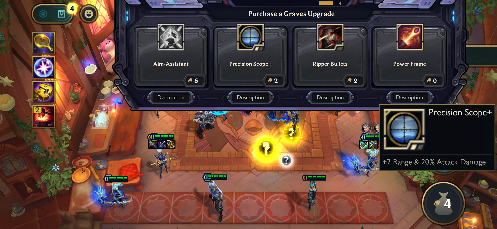

## Bug ID: `BUG_TFT_IOS_001`

**Title:** UI Issue: Shop gold amount covered by a persistent '0'.

**Reporter:** Quest2Test

**Date:** 18-04-2026

**Status:** `Closed`

**Assigned To:** TFT Team

---

## Environment

| Field | Details |
|---|---|
| Device / Platform | iPhone 12 Pro |
| Operating System | iOS 26.2 |
| Browser / Application | League of Legends: Teamfight Tactics |
| Build / Version | V16.8.763.8450 |
| Component / Area | UI |
| Reproducibility Rate | 3/3 - always reproducible |

---

## Description

### Steps to Reproduce
**Prerequisites:** Valid Riot Games Account

1. Queue up and load into a TFT match. (Normal, Ranked or Tocker's Trials)
2. Observe the screen immediately as the game starts and the UI loads in.
3. Look at the bottom right interface where the Shop gold counter is located.

### Expected Behaviour
The game UI should load without any rogue overlapping graphics, and the Shop should clearly display the player's current gold amount.

### Actual Behaviour
An overlapping Gold icon and '0' graphic load in immediately and persistently cover the real gold counter.

---

## Severity & Priority

| Field | Value |
|---|---|
| Severity | `Major` |
| Priority | `Medium` |

**Severity guide:**
- **Critical** - Game crash, data loss, progression blocker, security issue
- **Major** - Core feature broken, significant impact on gameplay or UX
- **Minor** - Feature partially broken, workaround exists
- **Trivial** - Cosmetic issue, typo, minor visual glitch

---

## Regression

| Field | Details |
|---|---|
| Regression? | No |
| Last known working build |  |
| Notes |  |

---

## Workaround

- **Workaround available?** Yes
- **Description:** The frozen UI can be clear with Graves Armory Upgrade Shop Appearance.
1.  Ensure Graves (5 Star unit) is on your active team.
2.  Wait for his Armory Upgrade shop to trigger.
3.  Interacting with/closing this shop forces a UI refresh, removing the stuck overlay.

---

## Evidence

- **Screenshots / Video:**

<table>
  <tr>
    <td>
      
    </td>
    <td>
      
    </td>
    <td>
      
    </td>
    <td>
      
    </td>
  </tr>
</table>

- **Logs / Console Output:**

---

## Additional Notes

---
