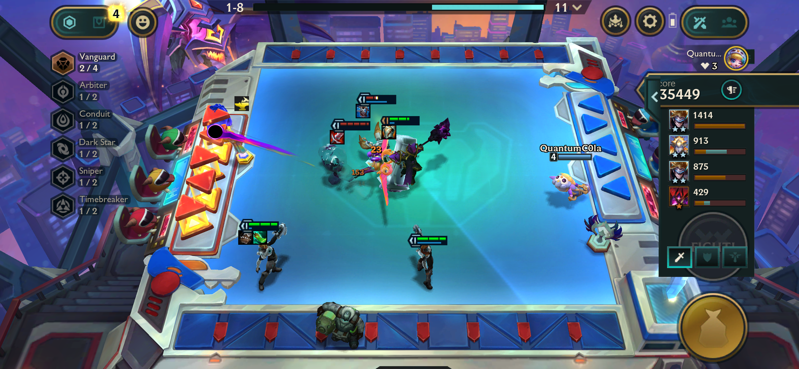

## Bug ID: `BUG_TFT_IOS_002`

**Title:** Tocker's Trials - Dark Star Animation plays without Synergy being active

**Reporter:** Quest2Test

**Date:** 28-05-2026

**Status:** `Open`

**Assigned To:** TFT Team

---

## Environment

| Field | Details |
|---|---|
| Device / Platform | iPhone 12 Pro |
| Operating System | iOS 26.2 |
| Browser / Application | League of Legends: Teamfight Tactics |
| Build / Version | V16.10.774.7445 |
| Component / Area | Gameplay |
| Reproducibility Rate | 3/3 - always reproducible |

---

## Description

### Steps to Reproduce
**Prerequisites:** Valid Riot Games Account

1. Queue up and load into a TFT match. (Tocker's Trials ONLY)
2. Add only One Dark Star Champion into your board.
3. Observe the Dark Star Synergy animation plays without an active Dark Star Synergy.
4. Sell the Dark Star champion so your board is empty.
5. Observe that the animation continues to play.

### Expected Behaviour
Unless two or more Dark Star champions are placed on the board the Dark Star Synergy should not be active and the animation should not play.

### Actual Behaviour
Dark Star Synergy Black Hole animation plays and synergy appears to be active despite one or less Dark Star Champions being on the board. Even when no Dark Star Champions are on the board afterwards the animation still plays.

---

## Severity & Priority

| Field | Value |
|---|---|
| Severity | `Trivial` |
| Priority | `Medium` |

**Severity guide:**
- **Critical** - Game crash, data loss, progression blocker, security issue
- **Major** - Core feature broken, significant impact on gameplay or UX
- **Minor** - Feature partially broken, workaround exists
- **Trivial** - Cosmetic issue, typo, minor visual glitch

---

## Regression

| Field | Details |
|---|---|
| Regression? | No |
| Last known working build |  |
| Notes |  |

---

## Workaround

- **Workaround available?** No
- **Description:**

---

## Evidence

- **Screenshots / Video:**

<table>
  <tr>
    <td>
      
    </td>
  </tr>
</table>

- **Logs / Console Output:**

---

## Additional Notes

---
